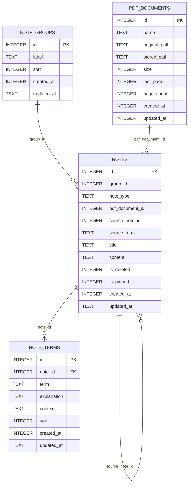

# Notepad Tauri 数据库脑图

> 来源：主要依据 `src-tauri/base/sql.rs` 的 `init_db()` 和数据库访问命令整理；同时抽查了 `src-tauri/notepad.db` 的当前 schema。

```mermaid
mindmap
  root((notepad.db / SQLite))
    初始化与位置
      Tauri 启动时执行 init_db
      运行时目录
        app.path().app_data_dir()
        set_current_dir(app_data_dir)
      数据库文件
        notepad.db
      PDF 文件目录
        pdfs/
    notes 笔记表
      主键
        id INTEGER PK AUTOINCREMENT
      分类
        group_id INTEGER
        逻辑关联 note_groups.id
      类型
        note_type TEXT DEFAULT normal
        normal 普通笔记
        pdf_note PDF 笔记
        web_summary 网页总结
        term_article 术语文章
      PDF 关联
        pdf_document_id INTEGER
        逻辑关联 pdf_documents.id
      来源关联
        source_note_id INTEGER
        自关联 notes.id
        source_term TEXT
      内容
        title TEXT
        content TEXT
      状态
        is_deleted INTEGER
        is_pinned INTEGER
      时间
        created_at INTEGER NOT NULL
        updated_at TEXT
      行为
        get_notes 只读取 is_deleted = 0
        delete_notes 软删除
        update_notes 更新标题和内容
        update_note_group 移动分类
        update_note_pinned 置顶
    note_groups 分类表
      主键
        id INTEGER PK AUTOINCREMENT
      字段
        label TEXT NOT NULL
        sort INTEGER DEFAULT 0
        created_at INTEGER NOT NULL
        updated_at TEXT
      约束
        分类名最多 20 个字符
      行为
        get_groups LEFT JOIN notes 统计未删除笔记数
        add_groups 新增分类
        update_group 重命名
        delete_group 物理删除分类
    note_terms 术语表
      主键
        id INTEGER PK AUTOINCREMENT
      关联
        note_id INTEGER NOT NULL
        FOREIGN KEY note_id -> notes.id
      字段
        term TEXT NOT NULL
        explanation TEXT NOT NULL
        context TEXT NOT NULL
        sort INTEGER DEFAULT 0
        created_at INTEGER NOT NULL
        updated_at TEXT
      索引
        idx_note_terms_note_id(note_id, sort, id)
      行为
        get_note_terms 按 sort 和 id 排序
        save_note_terms 事务内先删后插
    pdf_documents PDF 文档表
      状态
        代码已定义
        当前 src-tauri/notepad.db 尚未出现
      主键
        id INTEGER PK AUTOINCREMENT
      文件信息
        name TEXT NOT NULL
        original_path TEXT NOT NULL
        stored_path TEXT NOT NULL
        size INTEGER NOT NULL
      阅读状态
        last_page INTEGER DEFAULT 1
        page_count INTEGER DEFAULT 0
      时间
        created_at INTEGER NOT NULL
        updated_at INTEGER
      索引
        idx_pdf_documents_updated(updated_at DESC, created_at DESC, id DESC)
      行为
        import_pdf_file 导入并复制到 pdfs/
        get_pdf_documents 按更新时间倒序
        read_pdf_document_file 读取 stored_path
        update_pdf_reading_position 更新阅读进度
    关系概览
      note_groups 1 对多 notes
      notes 1 对多 note_terms
      pdf_documents 1 对多 notes
      notes 自关联生成 term_article
    当前库差异
      src-tauri/notepad.db 当前表
        notes
        note_groups
        note_terms
      当前库缺少
        pdf_documents
        notes.note_type
        notes.pdf_document_id
      说明
        运行时库位于 app_data_dir
        代码初始化会尝试补充新字段和新表
```

## ER 关系图



## 备注

- `note_terms.note_id` 是代码建表时声明的外键。
- `notes.group_id`、`notes.pdf_document_id`、`notes.source_note_id` 在代码中按关联字段使用，但建表语句没有声明外键约束。
- 当前仓库内的 `src-tauri/notepad.db` 和 Tauri 运行时的 `app_data_dir/notepad.db` 可能不是同一个文件；应用启动后会在运行时目录执行初始化。
